  

  

  <b>I ship applied-AI systems that measurably replace manual work</b> — computer vision pipelines,
  LLM-integrated automations, and speech fine-tunes, all with numbers attached.

 

  
  

  

---

## 🧠 Featured Work

<table>
<tr>
<td width="33%" valign="top">

**🛡️ AI CCTV Threat Detection**

Real-time detection of people, vehicles and weapons with <b>YOLOv8</b> plus a <b>locally-run LLM</b> for contextual anomaly reasoning — on-premise, zero cloud dependency.

- <b>~91%</b> threat detection accuracy
- <b>&lt;1.8s</b> alert latency
- <b>~35%</b> fewer false positives
- Tiered alerts: critical / warning / info

`YOLOv8` `LLM` `Python` `Streamlit`

</td>
<td width="33%" valign="top">

**🚦 Traffic Optimiser**

Live vehicle counting across <b>4 junctions</b> feeding a custom Weighted Density Algorithm that retimes signals in real time.

- <b>~42%</b> drop in average wait time
- Sub-second signal adjustments
- FastAPI + Socket.io streaming dashboard

<a href="https://github.com/Priinc3/traffic_Optimiser">repo →</a>

`YOLOv11` `FastAPI` `React` `Socket.io`

</td>
<td width="33%" valign="top">

**🗣️ Gujarati Talpada ASR**

Fine-tuned <b>openai/whisper-small</b> for a dialect with <b>no prior public dataset</b> — original vocab, sentence and recording-label sets, frozen encoder + fp16 on Colab T4.

- Training loss <b>1.65 → 0.232</b>
- ~65M params trained over 372 steps
- Model published to Hugging Face

<a href="https://huggingface.co/princetunes/whisper-small-gujarati-talpada">model →</a>

`Whisper` `Transformers` `PyTorch`

</td>
</tr>
<tr>
<td colspan="3" valign="top">

**⚙️ Production Automations @ Joyspoon**

| Automation | Outcome |
|---|---|
| **Invoice processing** — n8n + Claude API, PDF ingestion → vendor/amount/line-item extraction → role-based approval routing | <b>~90%</b> less processing time, zero manual data entry, full audit trail |
| **ERPNext manufacturing flow** — stripped non-essential modules, built a role-specific operational dashboard | Floor-worker onboarding: <b>days → under 2 hours</b> |
| **10+ n8n workflows** on AWS-hosted ERPNext V15 with LLM integration | <b>~60%</b> less manual overhead |

</td>
</tr>
</table>

---

## 🛠️ Toolbox

| Domain | Stack |
|---|---|
| **AI & ML** | LLM Integration · GenAI · RAG · LangChain · LangGraph · Prompt Engineering · LoRA/QLoRA · PEFT · SFT · Transfer Learning · YOLOv8/v11 · CNN/RNN/Transformers · Computer Vision · Agentic Systems · TensorFlow · PyTorch · scikit-learn |
| **Automation & Backend** | n8n · FastAPI · ERPNext/Frappe · REST APIs · Workflow Orchestration · Socket.io |
| **Programming** | Python · JavaScript/TypeScript · C · C++ |
| **Cloud & DevOps** | AWS (EC2, S3) · GCP (Vertex AI) · Docker · Git |

---

## 💼 Experience

- **AI Automation Intern** — Joyspoon, Ahmedabad · *Dec 2025 – Mar 2026*
  Architected and deployed 10+ n8n automation workflows on AWS-hosted ERPNext V15, integrating LLMs to remove manual data entry and cut processing overhead by ~60%.

- **AI Intern** — Artoon Solution Pvt Ltd, Ahmedabad · *May 2026 – Jul 2026*
  Built a production analytics + ML workflow for Royal TriPeaks using GA4/Firebase data to study player retention and dynamic difficulty.

---

## 🏅 Recognition & Certifications

- 🏆 **Smart India Hackathon 2025 — National Finalist**, selected among 500+ competing teams
- 🎓 **AWS Academy Graduate — Machine Learning Foundations** (20-hr training badge, Oct 2025)
- 🧩 **Anthropic** — Model Context Protocol (Intro & Advanced), Agent Skills, Subagents, Claude Code 101
- 🗣️ **Languages** — Gujarati (native) · Hindi · English

---

## 📬 Let's talk

  
  
  
  
  

  Open to AI/ML internships, junior GenAI & CV roles, and 2027-batch full-time programs — India or remote.

